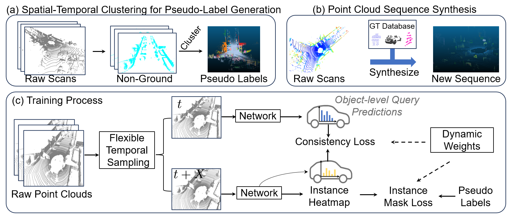

# SFT3D: Unsupervised Online 3D Instance Segmentation with Synthetic Sequences and Dynamic Loss (TMM2026)

This repository contains the official PyTorch implementation of the method **SFT3D**. For more details, please refer to the [original paper](https://www.arxiv.org/abs/2509.23194).



## Citation

If you use SFT3D in your research, please cite the following paper:

```
@article{zhang2025SFT3D,
  title = {{SFT3D}: Unsupervised Online Instance Segmentation through Time},
  author={Zhang, Yifan and Zhang, Wei and He, Chuangxin and Miao, Zhonghua and Hou, Junhui},
  journal={IEEE Transactions on Multimedia},
  year={2026}
}
```

---

## Supported Datasets

* **[SemanticKITTI](http://www.semantic-kitti.org/tasks.html#semseg)**
* **[nuScenes](https://www.nuscenes.org/lidar-segmentation)**
* **[PandaSet](https://pandaset.org/)**

Ensure that the datasets are placed in the `datasets` folder with lowercase names, structured as follows:

```
SFT3D
├── datasets
│   ├── nuscenes
│   │   ├── v1.0-trainval
│   │   ├── samples
│   │   ├── sweeps
│   ├── pandaset
│   │   ├── 001
│   │   ├── 002
│   │   └── ...
│   ├── semantickitti
│   │   └── sequences
```

**Note:** PandaSet does not natively provide instance ground-truth. To generate it, run:

```bash
python create_instance_gt_pandaset.py --sensor pandargt
```

This script processes the **PandarGT** sensor data. You can create new sequences using `create_pc_sequence.py`.

---

## Installation and Setup

1. Clone this repository:

   ```bash
   git clone https://github.com/valeoai/SFT3D.git
   cd SFT3D
   ```

2. Install dependencies:

   ```bash
   pip install -r requirements.txt
   ```

3. Prepare the datasets as described in the **Supported Datasets** section.

4. Install **Patchwork++** for dataset preprocessing (required for nuScenes and PandaSet):

   ```bash
   git clone https://github.com/url-kaist/patchwork-plusplus.git
   cd patchwork-plusplus
   pip install -e .
   ```

---

## Preprocessing

For **SemanticKITTI**, you can directly download the pre-processed segments:

```bash
wget https://github.com/valeoai/UNIT/releases/download/v1.0/segments_gridsample_sk.tar.gz
```

For **nuScenes** and **PandaSet**, you must run the preprocessing scripts:

```bash
python preprocess_nuscenes.py
python preprocess_pandaset.py
```

Note: Preprocessing may take several hours depending on your hardware.

---

## Training the Model

### 1. Non-temporal Training (Single Frame)

Run the following commands based on your dataset:

* **SemanticKITTI**:

  ```bash
  python main_instance_segmentation.py general.experiment_name=sk_single data/datasets=semantic_kitti data.batch_size=3 general.num_frames=1 data.test_batch_size=3 trainer.max_epochs=50
  ```

* **PandaSet (PandarGT)**:

  ```bash
  python main_instance_segmentation.py general.experiment_name=pdgt_single data/datasets=pandaset_pandargt data.batch_size=3 general.num_frames=1 data.test_batch_size=3 trainer.max_epochs=150
  ```

* **nuScenes**:

  ```bash
  python main_instance_segmentation.py general.experiment_name=ns_single data/datasets=nuscenes data.batch_size=3 general.num_frames=1 data.test_batch_size=3 trainer.max_epochs=4
  ```

### 2. Temporal Training (Multiple Frames)

To train the temporal models, use the following commands:

* **SemanticKITTI**:

  ```bash
  python main_instance_segmentation.py general.experiment_name=sk_temporal general.checkpoint=saved/sk_single/last-epoch.ckpt data/datasets=semantic_kitti data.batch_size=4 general.num_frames=2 general.consistency_loss=true data.test_batch_size=4 trainer.max_epochs=50
  ```

* **PandaSet (PandarGT)**:

  ```bash
  python main_instance_segmentation.py general.experiment_name=pdgt_temporal general.checkpoint=saved/pdgt_single/last-epoch.ckpt data/datasets=pandaset_pandargt data.batch_size=5 general.num_frames=2 general.consistency_loss=true data.test_batch_size=5 trainer.max_epochs=150
  ```

* **nuScenes**:

  ```bash
  python main_instance_segmentation.py general.experiment_name=ns_temporal general.checkpoint=saved/ns_single/last-epoch.ckpt data/datasets=nuscenes data.batch_size=5 general.num_frames=2 general.consistency_loss=true data.test_batch_size=5 trainer.max_epochs=4
  ```

---

## Inference

To run inference on a trained model, use the following commands:

* **SemanticKITTI**:

  ```bash
  python inference_instance_segmentation.py general.experiment_name=sk_temporal general.checkpoint=saved/sk_temporal/last-epoch.ckpt data.batch_size=1 general.forward_queries=true data/datasets=semantic_kitti data.predict_mode=validation
  ```

Adjust the command for other datasets or checkpoints. For non-temporal inference, set `general.forward_queries=false`.

Predictions will be saved in the `assets` directory of the dataset and are computed by default for the validation set only.

---

## Evaluation

After inference, evaluate the segmentation results:

For **SemanticKITTI**, run:

```bash
python evaluate_4dpanoptic_sk -p ../datasets/semantickitti/assets/sk_temporal
```

Adapt the command for other datasets.

---

## Troubleshooting

* **Memory Issues**: The code uses mixed-precision (bf16) to save memory, but it requires newer hardware. To disable mixed-precision and use higher memory usage, set `general.precision=32` in your config.

* **Slow Inference**: Evaluation on **nuScenes** can be slow due to optimizations in 4D-PLS, which may lead to overflow on large datasets.

---

## Acknowledgments

* We sincerely appreciate the open-source project [UNIT](https://github.com/valeoai/UNIT) developed by valeoai.
* Thanks to the authors of the **SemanticKITTI**, **nuScenes**, and **PandaSet** datasets.

---

Feel free to open issues or pull requests if you encounter problems or have suggestions!
